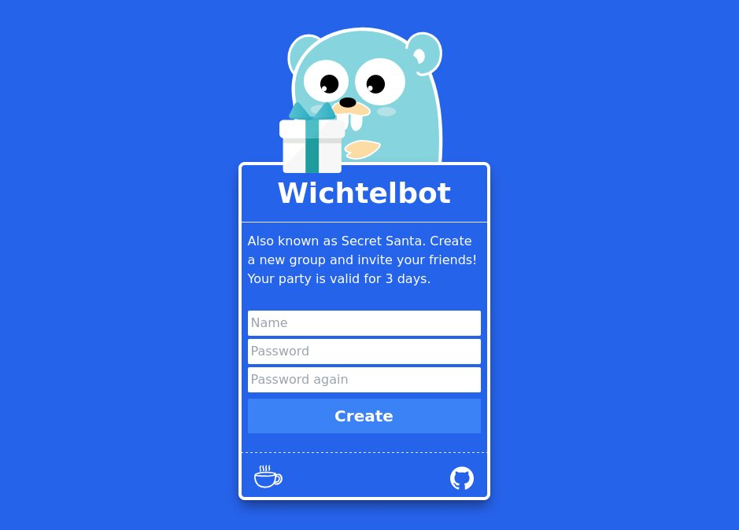

# Wichtelbot the Sequel

Christmas is nice and all. But finding gifts for everybody sucks, especial if your family is getting bigger each year.
That's why I came up with a solution. Battle tested on my own family 3 years in a row and now usable for everybody.

## [Play live on www.wichtelbot.com](https://www.wichtelbot.com/)

## How to play
Wichtelbot is App used to randomly assign Partners. Like Secret Santa.
The moderator registers a new party and then sends out invitations. When everybody is registered, the moderator presses the play button.
Each user will now see the assigned person. The party will persist for 3 Days. Then together with its users it will be deleted.

## Features
- <b>Notice</b>: Each player can leave a notice. Mainly used for allergies and picky family members.
- <b>Blacklist</b>: Additionally, each player can blacklist another. This feature has to be enabled by the moderator. This is very handy for parties with many couples, who want to exclude each other to make it more fun.
- <b>English & German</b>: Multi language support. Renders German if your browser is German.

## Technologies
Frontend with HTMX and Tailwind. Backend in go using only the standard libraries. The only exception is the sqlite3 driver.

## Privacy
There are no emails, no tracking and no ads. Members simply register with any imaginary name and a password. 3 Days later it gets deleted.
This also means there is no safe net. Forget your password and your user is gone.
